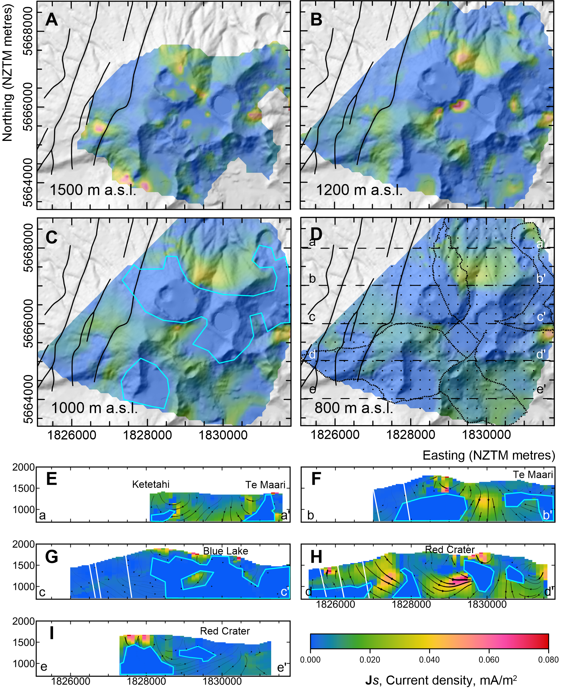

miller2018_Tongariro_SP_inversion
=================================

.. image:: https://travis-ci.org/simpeg-research/miller2018_Tongariro_SP_inversion.svg?branch=master
    :target: https://travis-ci.org/simpeg-research/miller2018_Tongariro_SP_inversion

.. image:: https://mybinder.org/badge.svg
    :target: https://mybinder.org/v2/gh/simpeg-research/miller2018_Tongariro_SP_inversion/master

Notebooks to run inversion code for SP models at Mt Tongariro hydrothermal system. Published as "Segmentation of vapour and condensate in a hydrothermal system: Insights from self-potential inversion at Mount Tongariro, New Zealand"

**Summary**

Inversion of a reconnaissance scale SP survey over a vapour dominated hydrothermal system at Mt Tongariro, New Zealand, reveals a discontinuous vapour zone distinguished by zero source current density, Js.  The vapour zone is surrounded by low to moderate Js interpreted to be circulating condensate liquid.  The system is bound to the west by fault zones that act as conduits for down flowing groundwater as well as barriers for hydrothermal system.  Our model suggests localised small scale circulation associated with individual surface thermal features rather than a single circulating system, and accounts for the lack of widespread anomalous geochemical observations prior to the 2012 Te Maari eruption. Inversion for source current density allows us to distinguish vapour vs liquid zones, not possible through qualitative interpretation of SP data.  In turn these zones may act as proxies for permeability and temperature distribution within the system.  Care is still required to interpret SP data and inversion models, and consideration of zeta potential polarity in unaltered rocks is important.

**Notebooks**

There are 2 notebooks in this repository:

- `Js_inversion.ipynb <https://github.com/simpeg-research/miller2018_Tongariro_SP_inversion/blob/master/notebooks/Js_inversion.ipynb>`_ : runs Js (vector) inversion
- `DivJs_inversion.ipynb <https://github.com/simpeg-research/miller2018_Tongariro_SP_inversion/blob/master/notebooks/DivJs_inversion.ipynb>`_ : run Div Js (scalar) inversion

**Usage**

Dependencies are specified in `requirements.txt <https://github.com/simpeg-research/miller2018_Tongariro_SP_inversion/blob/master/requirements.txt>`_

.. code::

    pip install -r requirements.txt

Please `make an issue <https://github.com/simpeg-research/miller2018_Tongariro_SP_inversion/issues>`_ if you encounter any problems while trying to run the notebooks.
